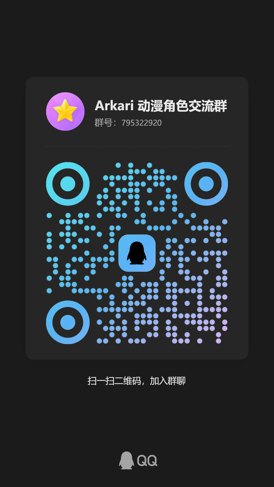

<h1 align="center">Arkari Just ARKARI</h1>

<table align="center">
  <tr>
    <td align="center">
      <a href="https://qm.qq.com/q/ZBra3aCswY">
        
      </a>
    </td>
    <td align="center">
      <a href="https://discord.gg/f5nDYjsrKZ">
        
      </a>
      <br />
      <a href="https://qm.qq.com/q/ZBra3aCswY">
        
      </a>
      <br />
      <sub>QQ Group: 795322920</sub>
    </td>
  </tr>
</table>

<p align="center">
 <a href="https://github.com/komimoe/Arkari/issues">
   
 </a>
 <a href="https://github.com/komimoe/Arkari/network/members">
   
 </a>  
 <a href="https://github.com/komimoe/Arkari/stargazers">
   
 </a>
 <a href="https://github.com/komimoe/Arkari/LICENSE">
   
 </a>
</p>
<p align="center">
 <a href="./README.md">
  
 </a>
</p>
<h3 align="center">Yet another LLVM-based obfuscator derived from Goron</h3>

## Introduction
Supported features:
 - Inter-procedural obfuscation
 - Indirect jumps with encrypted jump targets (`-mllvm -irobf-indbr`)
 - Indirect function calls with encrypted target function addresses (`-mllvm -irobf-icall`)
 - Indirect global variable references with encrypted variable addresses (`-mllvm -irobf-indgv`)
 - C string encryption (`-mllvm -irobf-cse`)
 - Inter-procedural control flow flattening obfuscation (`-mllvm -irobf-fla`)
 - Integer constant encryption (`-mllvm -irobf-cie`) (Win64-MT-19.1.3-obf1.6.0 or later)
 - Floating-point constant encryption (`-mllvm -irobf-cfe`) (Win64-MT-19.1.3-obf1.6.0 or later)
 - Microsoft CXXABI RTTI Name Eraser (experimental) [requires a configuration file path and a `randomSeed` field in that file (32 bytes; pad with 0 if shorter, truncate if longer)] (`-mllvm -irobf-rtti`) (Win64-MT-20.1.7-obf1.7.0 or later)
 - All features (`-mllvm -irobf-indbr -mllvm -irobf-icall -mllvm -irobf-indgv -mllvm -irobf-cse -mllvm -irobf-fla -mllvm -irobf-cie -mllvm -irobf-cfe -mllvm -irobf-rtti`)
 - Or manage via a configuration file (`-mllvm -arkari-cfg="Configuration file path|Your config path"`) (Win64-MT-20.1.7-obf1.7.0 or later)

Improvements over Goron:
 - Created because the original author stated they would not update LLVM or continue development for the foreseeable future ("tens of thousands of years") (https://github.com/amimo/goron/issues/29)
 - Updated LLVM version
 - Print output file names during compilation to make builds easier to track
 - Fixed numerous known bugs
 ```
 - Fixed SEH explosion issues after obfuscation
 - Fixed issue where global variables imported by DLLs were obfuscated, losing the `__impl` prefix
 - Fixed issue where certain scenarios with LLVM2019 (2022) plugins caused duplicate parameter additions, preventing compilation
 - Fixed stack overflow issue with x86 indirect calls
 - ...
 ```

## Generate VS2026 debug project (X86+AArch64 Targets)

- Windows + Visual Studio 18 2026 + vcpkg

```
install vcpkg and set VCPKG_ROOT

vcpkg install zlib:x64-windows-static
vcpkg install libLZMA:x64-windows-static
vcpkg install libxml2:x64-windows-static

open x64 Native Tools Command Prompt for VS
then run:

mkdir build_vsproj
cd build_vsproj

cmake -DCMAKE_CXX_FLAGS="/utf-8 /EHsc" ^
      -DCMAKE_C_FLAGS="/utf-8" ^
      -DCMAKE_INSTALL_PREFIX="./install" ^
      -DCMAKE_MSVC_RUNTIME_LIBRARY=MultiThreaded ^
      -DCMAKE_BUILD_TYPE=Debug ^
      -DLLVM_ENABLE_PROJECTS="clang;clang-tools-extra;lld;lldb" ^
      -DLLVM_TARGETS_TO_BUILD="X86;AArch64" ^
      -DLLVM_ENABLE_RUNTIMES="compiler-rt;openmp" ^
      -DCOMPILER_RT_BUILD_ORC=OFF ^
      -DLLVM_BUILD_LLVM_C_DYLIB=ON ^
      -DPython3_FIND_REGISTRY=NEVER ^
      -DLLDB_ENABLE_PYTHON=OFF ^
      -DLLVM_BUILD_TOOLS=ON ^
      -DLLVM_ENABLE_LIBXML2=FORCE_ON ^
      -DCLANG_ENABLE_LIBXML2=OFF ^
      -DLLVM_ENABLE_RPMALLOC=OFF ^
      -DLLVM_INCLUDE_TESTS=OFF ^
      -DLLVM_INCLUDE_EXAMPLES=OFF ^
      -DLLVM_INCLUDE_BENCHMARKS=OFF ^
      -DLLVM_ENABLE_ASSERTIONS=ON ^
      -DLLVM_RELEASE_ENABLE_LTO=OFF ^
      -DCMAKE_TOOLCHAIN_FILE="%VCPKG_ROOT%/scripts/buildsystems/vcpkg.cmake" ^
      -DVCPKG_TARGET_TRIPLET="x64-windows-static" ^
      -G "Visual Studio 18 2026" ^
      ../llvm
```

## Compilation (Windows x64 runtime with X86+AArch64 Targets)

- Windows + Visual Studio 18 2026 + ninja + vcpkg for libxml2, libLZMA, zlib

```
install ninja and add it to PATH
install vcpkg and set VCPKG_ROOT

vcpkg install zlib:x64-windows-static
vcpkg install libLZMA:x64-windows-static
vcpkg install libxml2:x64-windows-static

open x64 Native Tools Command Prompt for VS
then run:

mkdir build_ninja
cd build_ninja

cmake -DCMAKE_CXX_FLAGS="-DLIBXML_STATIC /utf-8 /EHsc" ^
      -DCMAKE_C_FLAGS="-DLIBXML_STATIC /utf-8" ^
      -DCMAKE_INSTALL_PREFIX="./install" ^
      -DCMAKE_MSVC_RUNTIME_LIBRARY=MultiThreaded ^
      -DCMAKE_BUILD_TYPE=Release ^
      -DLLVM_ENABLE_PROJECTS="clang;clang-tools-extra;lld;lldb" ^
      -DLLVM_TARGETS_TO_BUILD="X86;AArch64" ^
      -DLLVM_ENABLE_RUNTIMES="compiler-rt;openmp" ^
      -DCOMPILER_RT_BUILD_ORC=OFF ^
      -DLLVM_BUILD_LLVM_C_DYLIB=ON ^
      -DPython3_FIND_REGISTRY=NEVER ^
      -DLLDB_ENABLE_PYTHON=OFF ^
      -DLLVM_BUILD_TOOLS=ON ^
      -DLLVM_ENABLE_LIBXML2=FORCE_ON ^
      -DCLANG_ENABLE_LIBXML2=OFF ^
      -DLLVM_ENABLE_RPMALLOC=ON ^
      -DLLVM_INCLUDE_TESTS=OFF ^
      -DLLVM_INCLUDE_EXAMPLES=OFF ^
      -DLLVM_INCLUDE_BENCHMARKS=OFF ^
      -DLLVM_ENABLE_ASSERTIONS=OFF ^
      -DLLVM_RELEASE_ENABLE_LTO=OFF ^
      -DCMAKE_TOOLCHAIN_FILE="%VCPKG_ROOT%/scripts/buildsystems/vcpkg.cmake" ^
      -DVCPKG_TARGET_TRIPLET="x64-windows-static" ^
      -G "Ninja" ^
      ../llvm

ninja
ninja install

```

## Compilation (macOS AArch64 runtime with AArch64+X86 Targets)
- macOS + XCode Command Tools + brew + ninja
```
xcode-select --install
brew install ninja

cmake -G Ninja \
  -DCMAKE_BUILD_TYPE=Release \
  -DCMAKE_INSTALL_PREFIX="./install" \
  -DLLVM_ENABLE_PROJECTS="clang;clang-tools-extra;lld;lldb" \
  -DLLVM_TARGETS_TO_BUILD="AArch64;X86" \
  -DLLVM_ENABLE_RUNTIMES="compiler-rt;openmp" \
  -DCOMPILER_RT_BUILD_ORC=OFF \
  -DLLVM_BUILD_LLVM_C_DYLIB=ON \
  -DLLVM_BUILD_TOOLS=ON \
  -DLLVM_INCLUDE_TESTS=OFF \
  -DLLVM_INCLUDE_EXAMPLES=OFF \
  -DLLVM_INCLUDE_BENCHMARKS=OFF \
  -DLLVM_ENABLE_ASSERTIONS=OFF \
  -DLLVM_RELEASE_ENABLE_LTO=OFF \
  -DLLVM_RELEASE_ENABLE_PGO=OFF \
  ../llvm

ninja
ninja install
```

## Compilation (Linux x86_64 Target)
```
mkdir build
cd build
cmake -G Ninja \
  -DCMAKE_BUILD_TYPE=Release \
  -DCMAKE_INSTALL_PREFIX="./install" \
  -DLLVM_ENABLE_PROJECTS="clang;clang-tools-extra;lld;lldb" \
  -DLLVM_TARGETS_TO_BUILD="X86" \
  -DLLVM_ENABLE_RUNTIMES="compiler-rt;openmp" \
  -DCOMPILER_RT_BUILD_ORC=OFF \
  -DLLVM_BUILD_LLVM_C_DYLIB=OFF \
  -DLLVM_BUILD_TOOLS=ON \
  -DLLVM_INCLUDE_TESTS=OFF \
  -DLLVM_INCLUDE_EXAMPLES=OFF \
  -DLLVM_INCLUDE_BENCHMARKS=OFF \
  -DLLVM_ENABLE_ASSERTIONS=OFF \
  -DLLVM_RELEASE_ENABLE_LTO=OFF \
  -DLLVM_RELEASE_ENABLE_PGO=OFF \
  -DLLVM_ENABLE_PIC=ON \
  ../llvm

ninja -j8
ninja install
```

## What if compilation fails?
Use `-k` with Ninja/Make to continue when some files fail.
When running `make install`, use `-i` to skip files that failed to build.

## Usage
Enable specific obfuscation features via compiler options. For example, to enable indirect jump obfuscation:

```
$ path_to_the/build/bin/clang -mllvm -irobf -mllvm --irobf-indbr test.c
```

For Autotools projects:
```
$ CC=path_to_the/build/bin/clang or CXX=path_to_the/build/bin/clang
$ CFLAGS+="-mllvm -irobf -mllvm --irobf-indbr" or CXXFLAGS+="-mllvm -irobf -mllvm --irobf-indbr" (or any other obfuscation-related flags)
$ ./configure
$ make
```

For Visual Studio projects, you can use the Visual Studio plugin: https://github.com/KomiMoe/llvm2019

## Enable or Disable Obfuscation Options per Function with **Annotate**:
(Win64-19.1.0-rc3-obf1.5.0-rc2 or later)

Annotations **always override** command-line parameters.

`+flag` indicates enabling a feature for the current function, `-flag` indicates disabling a feature for the current function.

String encryption is module-scoped in LLVM, so the string encryption option must be included in the compilation options; otherwise, it will not be enabled.

Available annotation flags:
- `fla`
- `icall`
- `indbr`
- `indgv`
- `cie`
- `cfe`

```cpp
[[clang::annotate("-fla -icall")]]
int foo(auto a, auto b) {
    return a + b;
}

[[clang::annotate("+indbr +icall")]]
int main(int argc, char** argv) {
    foo(1, 2);
    std::printf("hello clang\n");
    return 0;
}
// Alternatively, you may use __attribute((__annotate__(("+indbr"))))
```

If you do not wish to enable passes for the entire program, you can add only `-mllvm -irobf` to the compilation command-line parameters and use **annotate** to control which functions to obfuscate. Enabling only **-irobf** without **annotate** will not run any obfuscation passes.

Using only **annotate** without any obfuscation command-line parameters will ***not*** enable any passes.

You **cannot** enable and disable the same obfuscation parameter at the same time!
The following scenario will result in an error:

```cpp
[[clang::annotate("-fla +fla")]]
int fool(auto a, auto b){
    return a + b;
}
```

## Control the Intensity of Specific Obfuscation Passes Using One of the Following Methods
(Win64-19.1.0-rc3-obf1.5.1-rc5 or later)

If no intensity is specified, the default intensity is 0. The priority of annotations always overrides command-line parameters.

Available passes:
- `icall` (Intensity range: 0-3)
- `indbr` (Intensity range: 0-3)
- `indgv` (Intensity range: 0-3)
- `cie` (Intensity range: 0-3)
- `cfe` (Intensity range: 0-3)

1. Set per-function intensity with **annotate**:

 `^flag=1` sets the intensity level for the current function (here, 1)
 
```cpp
// ^icall= specifies the intensity of icall
// +icall indicates enabling icall obfuscation for the current function; if you have enabled icall in the command line, you do not need to add +icall

[[clang::annotate("+icall ^icall=3")]]
int main() {
    std::cout << "HelloWorld" << std::endl;
    return 0;
}
```

2. Set pass intensity via command-line parameters

E.g., indirect function calls with encrypted target function addresses, intensity set to 3 (`-mllvm -irobf-icall -mllvm -level-icall=3`)

## Manage Obfuscation Parameters via a Configuration File
(Win64-MT-20.1.7-obf1.7.0 or later)

Add to compilation parameters: `-mllvm -arkari-cfg="Configuration file path|Your config path"`

The path can be absolute or relative to the compiler's working directory.

The configuration file format is JSON.

E.g.:
```json
{
  "randomSeed": "zX0^bS5|vP0@xO4+sF3[pX8,fG2^rT9?",
  "indbr": {
    "enable": true,
    "level": 3
  },
  "icall": {
    "enable": true,
    "level": 3
  },
  "indgv": {
    "enable": true,
    "level": 3
  },
  "cie": {
    "enable": true,
    "level": 3
  },
  "cfe": {
    "enable": true,
    "level": 3
  },
  "fla": {
    "enable": true
  },
  "cse": {
    "enable": true
  },
  "rtti": {
    "enable": true
  }
}
```

## Acknowledgements

Thanks to [JetBrains](https://www.jetbrains.com/?from=KomiMoe) for providing free licenses (e.g., [ReSharper C++](https://www.jetbrains.com/resharper-cpp/?from=KomiMoe)) for my open-source projects.

[](https://www.jetbrains.com/resharper-cpp/?from=KomiMoe)

## Star History

<a href="https://www.star-history.com/#komimoe/Arkari&date">
 <picture>
   <source media="(prefers-color-scheme: dark)" srcset="https://api.star-history.com/svg?repos=komimoe/Arkari&type=Date&theme=dark" />
   <source media="(prefers-color-scheme: light)" srcset="https://api.star-history.com/svg?repos=komimoe/Arkari&type=Date" />
   
 </picture>
</a>

## References

+ [Goron](https://github.com/amimo/goron)
+ [Hikari](https://github.com/HikariObfuscator/Hikari)
+ [ollvm](https://github.com/obfuscator-llvm/obfuscator)

## License
This project is released under a mixed license. Please note:
1. Third-party library code or modified parts adhere to their original open-source licenses.
2. This project has obtained partial project authorization and is not subject to certain constraints.
3. The remaining logic code of the project adopts the [license of this repository](./LICENSE).

**This repository exists to enhance users' ability to protect their own code via logic obfuscation and encryption. Any development based on KomiMoe/Arkari without the repository owner's permission is prohibited. Please comply with local laws and regulations. Any issues arising from usage are the responsibility of the user and those providing improper-use tutorials.**
